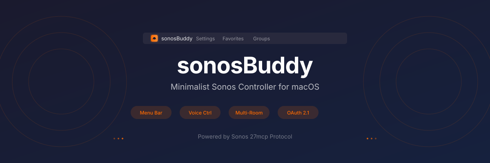
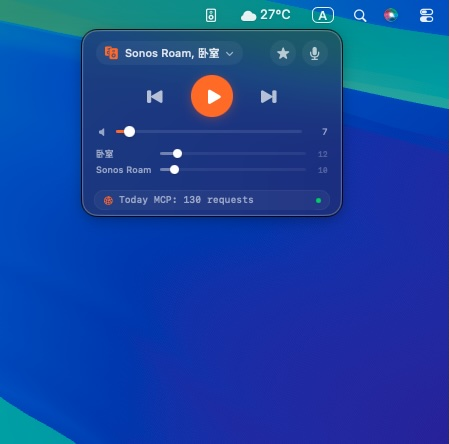
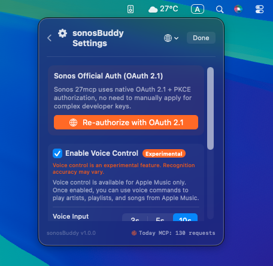

<p align="center">
  
</p>

<p align="center">
  A minimalist macOS menu bar controller for Sonos, powered by the official Sonos 27mcp.
  <br>
  <a href="./README.zh.md">🇨 中文文档</a>
</p>

<p align="center">
  <a href="#installation"></a>
  
  
  
</p>

---

## ✨ Features

<table>
<tr>
<td width="50%">

**🎛️ Compact Menu Bar Panel**
260px frosted-glass design, blends seamlessly with macOS.

**🔊 Multi-Room Grouping**
Dropdown multi-select speakers with linked & independent volume.

**⭐ Sonos Favorites**
One-click browse and play saved stations, playlists & albums.

</td>
<td width="50%">

**🎤 Voice Control (Experimental)**
Native speech recognition — play artists, songs, albums & playlists by voice.

**🔐 OAuth 2.1 Auth**
One-click browser authorization, ready out of the box.

**📊 MCP Request Counter**
Track daily API usage right in the status bar.

</td>
</tr>
</table>

---

## 🚀 Installation

### Option 1: Download (Recommended)

1. Go to **[Releases](https://github.com/holystool/sonosBuddy/releases)** and download `sonosBuddy.zip`
2. Unzip and drag `sonosBuddy.app` into your **Applications** folder
3. Launch — a Sonos icon appears in your menu bar

> **Developer Signed**: This app is signed with a valid Apple Developer ID and includes Hardened Runtime. If macOS still shows a warning, go to **System Settings → Privacy & Security** and click **"Open Anyway"**.

### Option 2: Build from Source

```bash
git clone https://github.com/holystool/sonosBuddy.git
cd sonosBuddy
xcodebuild -project sonosBuddy.xcodeproj -scheme sonosBuddy -configuration Release build
```

The built app will be at `build/Release/sonosBuddy.app`.

---

## 📸 Screenshots

<p align="center">
  &nbsp;&nbsp;&nbsp;&nbsp;
  
</p>

<p align="center">
  <em>Left: Compact player panel with multi-room volume control &nbsp;|&nbsp; Right: Settings with OAuth authorization</em>
</p>

---

## 📖 Quick Start

| Step | Action |
|:----:|:-------|
| **1** | Click menu bar icon → Settings gear → **"Sign in with Sonos Account"** → complete OAuth in browser |
| **2** | Tap the speaker name capsule → check/uncheck speakers (takes effect instantly) |
| **3** | Tap the ★ star icon → browse and play your Sonos saved playlists & stations |
| **4** | Tap the 🎤 mic button → speak a command (e.g. "play Taylor Swift", "volume 40") |

---

## 🎤 Voice Control

> ⚠️ Voice control is an **experimental feature**. Speech recognition accuracy may vary.

### Why Voice Control?

Sonos favorites are limited to manually saved stations and playlists — you can't search the full music library. **Apple Music**, however, is not restricted by Sonos favorites. Through Sonos MCP, voice control enables full-library search and playback of any artist, song, album, or playlist in Apple Music.

### Recommended Voice Commands

Voice commands support both **Chinese** and **English**. No special wake word needed — just speak naturally:

| Action | Chinese Example | English Example |
|:------:|:----------------|:----------------|
| Play artist | "播放周杰伦的歌" | "play Taylor Swift" |
| Play song | "播放晴天" | "play Shape of You" |
| Play album | "播放专辑范特西" | "play album Rumours" |
| Play playlist | "播放歌单轻松流行" | "play playlist Chill Hits" |

>  **Tip**: MCP services consume daily quota. For basic controls (play/pause, volume, skip), **use the on-screen buttons** instead of voice — this avoids wasted quota from speech recognition errors.

---

## ⚙️ About MCP

sonosBuddy communicates with your Sonos system via the official **Sonos 27mcp** (Model Context Protocol).

### Quota & Reset

The MCP API has a **daily request quota**:

- **Reset time**: Every day at **08:00 Beijing time** (UTC 00:00)
- **Tracking**: The MCP request counter appears in both the **player panel bottom** and the **settings page** — use this to estimate your daily consumption
- **Normal usage**: Typical daily use (a few dozen playback controls) is well within the quota

### Optimizations

To minimize MCP requests, sonosBuddy includes several design optimizations:

- **Static data caching**: Music service lists and other static info are fetched once and cached locally
- **Debounce & cascade prevention**: Playback controls are optimized to avoid multiplied refresh calls
- **Simplified play state**: Some playback operations skip state re-reading to save requests

> ⚠️ **Note**: These optimizations may cause the play/pause button to briefly show an outdated state (e.g., still showing "play" after pausing). This **does not affect actual playback** — the next tap will sync the state.

### Response Latency

MCP operates over the network, so there is a slight delay compared to local control — typically **1–3 seconds**. This is normal, especially during initial connection or network fluctuations.

---

## 🛠 Tech Stack

- **Swift 5.0** + **SwiftUI** + **AppKit**
- **Xcode** native project
- **Sonos 27mcp** official MCP protocol (34 tools)
- **OAuth 2.1 + PKCE** secure authorization
- **AVFoundation** native speech recognition

---

## ☕ Support the Author

If sonosBuddy is useful to you, consider supporting the project:

| Method | How |
|:------:|:----|
| **Ko-fi** | [ko-fi.com/loveuncleg](https://ko-fi.com/loveuncleg) |

Every cup of coffee keeps the project going! ☕

---

## 📄 License

MIT
